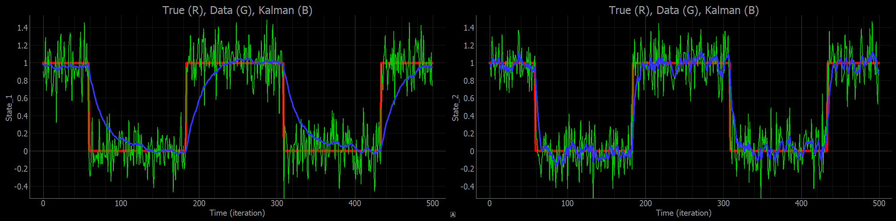

## Start using the library in your Arduino projects

### Equations

Your state evolution model and state observation are respectively given by the matrix equations

&nbsp;&nbsp;&nbsp;&nbsp;&nbsp;&nbsp;x<sub>k</sub> = F<sub>k</sub> x<sub>k-1</sub> + B<sub>k</sub> u<sub>k</sub> + q<sub>k</sub>

&nbsp;&nbsp;&nbsp;&nbsp;&nbsp;&nbsp;y<sub>k</sub> = H<sub>k</sub> x<sub>k</sub> + r<sub>k</sub>

where _k_ is the time step, _x_ the state vector, and _y_ the measurement vector. The full list of definitions and respective dimensions are summarized in the table below.

| NAME | DIMENSION       | DEFINITION                       |
|------|-----------------|----------------------------------|
| x    | Nstate          | State vector                     |
| F    | Nstate x Nstate | Time evolution matrix            |
| B    | Nstate x Ncom   | Command matrix (optional)        |
| u    | Ncom            | Command vector                   |
| Q    | Nstate x Nstate | Model covariance (~1/inertia)    |
| y    | Nobs            | Observation vector (measurement) |
| H    | Nobs x State    | Observation matrix               |
| R    | Nobs x Nobs     | Noise covariance                 |

### Examples

Examples are provided in the so-called `examples/` subfolder. Open them to get an idea on how to use the Kalman library.

* `kalman_minimal` : Empty shell ready to be filled with your state equations and measurements

* `kalman_step` : Numerical simulation of a noisy measurement on a step function so you do not need to plug any components to play with the Kalman library. Also includes a Python file to grab the measurements from Arduino and plot them. See figure below.



_The figure above shows two examples of Kalman filter (blue) applied on noisy data (green). The true state (red) is a step function. On the left graph, components of_ Q  _are chosen small (high inertia). Noise is efficiently filtered but response time is longer with respect to the right graph._

### Detailed explanations

Using the Kalman library in your Arduino files is (I hope) straightforward. First include the library in your `.ino` file. Also use the `BLA` (BasicLinearAlgebra) namespace since you will need to define some BLA vectors
```cpp
#include "Kalman.h"
using namespace BLA
```

Then define your number of states, number of observations and eventually number of commands. For the sake of simplicity, we will start without any command
```cpp
#define Nstate 2
#define Nobs 2
```

You can now define a Kalman filter and an observation vector
```cpp
KALMAN<Nstate, Nobs> K;
BLA::Matrix<Nobs> obs;
```

In the `setup` and `loop` functions you can now access to all the matrices `K.F`, `K.H`, `K.x`, `K.Q`, `K.R`, `K.P`... You can modify them, but be careful that inloop modifications of `K.x` or `K.P` might lead to unconsistent results! If you want to access to the `K.x` estimate, it is better to use the method
```cpp
BLA::Matrix<Nstate> my_x = K.getxcopy();
```

And of course you can update your Kalman filter with a new measure
```cpp
obs = fill_with_sensor_measures(); // grab here your sensor data and fill in the obs vector
K.update(obs);
```