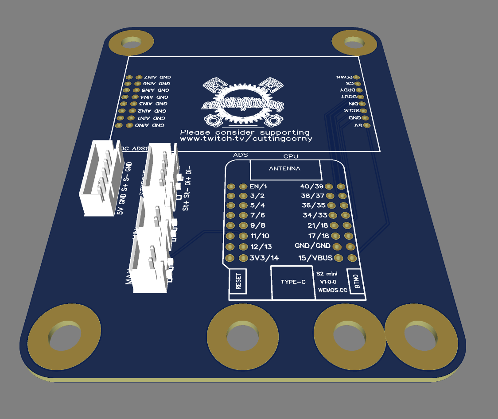
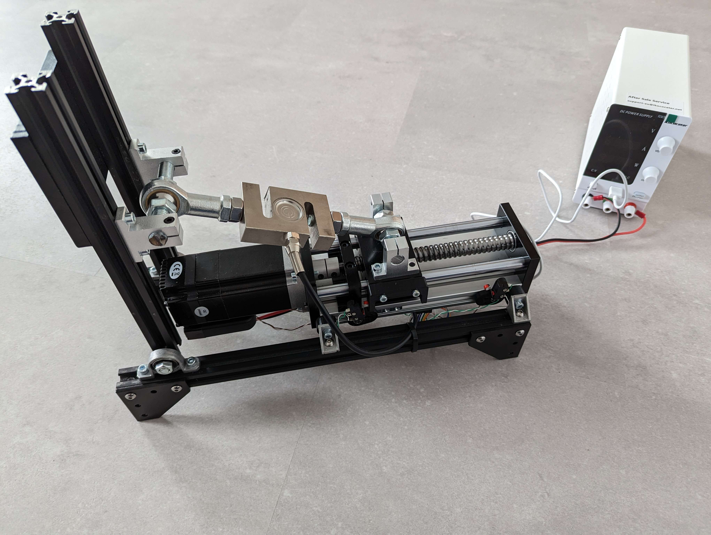
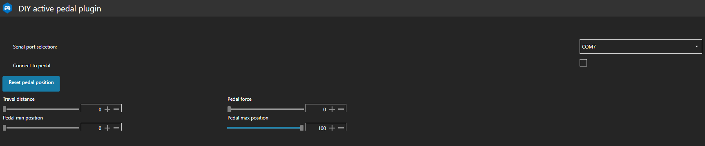
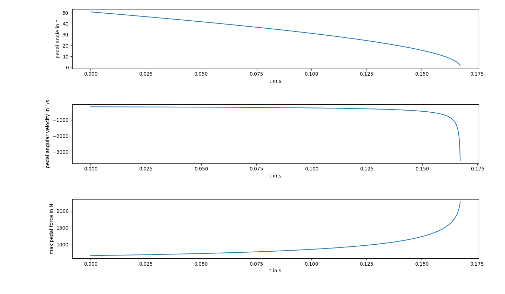

# DIY-Sim-Racing-Active-Pedal
This DIY active pedal design is based on the original design from @tjfenwick.

# Disclaimer
This product is essentialy a robot. If not interacted with care, it may cause harm.
I'm not responsible for any harm caused by this design suggestion. Use responsible and at your own risk.  

# Discord
For better communication, a [Discord](https://discord.gg/j8QhD5hCv7) server has been created. 
Feel free to join, research before you build and ask questions.

# Hardware
## ESP32
The embedded code of the DIY active pedal runs on an ESP32 microcontroller. Some PCB design, which hold the ESP32 breakoutboard, the ADC breakoutboard and connectors are uploaded to the [Wiring](Wiring) directory. They were used to proof the concept. 
The regular ESP32 is currently recommended over the ESP32 S2, as it has a FPU and it performs better with the stepper library. ESP32 S2 is losing steps currently.

ESP32 PCB            |  ESP32 S2 mini PCB
:-------------------------:|:-------------------------:
  |  

A more sophisticated custom PCB is currently under development and tested. Please refer to the Discord for up-to-date designs.

## Mechanical design
Here are some examples of mechanical designs awesome DIYers have done: 

| Design           |  Link |
:------------------------- | :-------------------------
|  |  [Tjfenwick design](https://github.com/tjfenwick/DIY-Sim-Racing-Active-Pedal)|
|  |  [Bjoes design](https://github.com/Bjoes/DIY-Active-pedal-mechanical-design)|
|  |  [GWiz design](https://www.printables.com/de/model/557527-simucube-style-active-pedal/files)|
|  |  [ChrGri design](Design/MechanicalDesign.md)|

## BOM
The [BOM](Design/BOM.md) refers to the pedal design which I have choosen, see [here](Design/MechanicalDesign.md).

  
# Software

## ESP32 code

### Architecture
A Doxygen report of the sources can be found [here](https://chrgri.github.io/DIY-Sim-Racing-Active-Pedal/Arduino/html/index.html).

### Built from source
To flash the [code](Arduino/Esp32/Main), e.g. via Ardiono IDE to esp32. 

### flash prebuilt binaries via webflasher
HASN'T BEEN TESTED YET:
The prebuilt binaries for the regular ESP32 can be found [here](Arduino/Esp32/bin). They can be flashed via the ESP [webflasher](https://esp.huhn.me/). 

## SimHub plugin:
The SimHub plugin was designed to communicate with the esp32 to (a) modify the pedal configuration, e.g. the force vs. travel parameterization and (b) to trigger effects such as ABS oscillations.  

To install the plugin, copy the plugin [binaries](SimHubPlugin/bin) content to your SimHub directory, e.g. C:/Program Files (x86)/SimHub

# Misc
## Pedal kinematics calculation
To get a better understanding of the motion and forces, a [python](Validation/PedalKinematics/main.py) script for simulation of the pedal angle, the pedal angular velocity and maximum pedal force has been written. Feel free to tune the pedal geometry as needed. The simulation result for my pedal geometry looks as follows:

# Todo
- [ ] Add Doxygen + Graphviz to the project to automatically generate documentation, architecureal design overview, etc.
- [ ] Add automatic system identification of pedal response
- [ ] Add model-predictive-controll to the ESP code for improved pedal response
- [ ] Add build manual
- [ ] Create video describing the build progress and the features
- [ ] https://github.com/gin66/FastAccelStepper/issues/194
- [ ] https://github.com/br3ttb/Arduino-PID-Library/issues/138
- [ ] GUI design improvements for the SimHub plugin
- [ ] SimHub plugin: Bugfix for COM port selection wrong, when switching between pedals
- [ ] Send SimHub data via wifi to ESP
- [ ] Automatically generate the bin files and refer to the ESP32 [webflasher](https://esp.huhn.me/)
