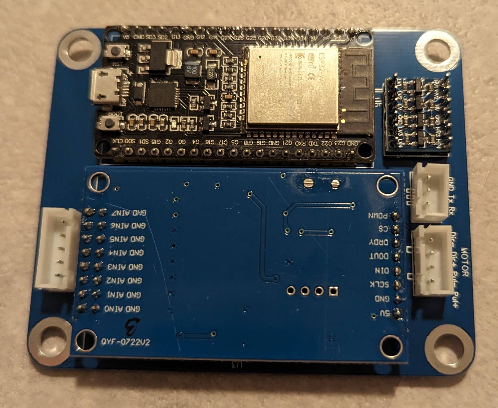

[](https://github.com/ChrGri/DIY-Sim-Racing-Active-Pedal/actions/workflows/arduino.yml)
[](https://github.com/ChrGri/DIY-Sim-Racing-Active-Pedal/actions/workflows/main.yml)

# DIY-Sim-Racing-Active-Pedal
This DIY active pedal design is based on the original design from @tjfenwick.


# Disclaimer
This product is essentialy a robot. If not interacted with care, it may cause harm.
I'm not responsible for any harm caused by this design suggestion. Use responsible and at your own risk.  


# Discord
For better communication, a [Discord](https://discord.gg/j8QhD5hCv7) server has been created. 
Feel free to join, research before you build and ask questions.


# Hardware
## Electronics

### PCB design
The embedded code of the DIY active pedal runs on an ESP32 microcontroller. The PCB design was developed to proof the concept. It holds the ESP32 breakoutboard, the ADC breakoutboard, a levelshifter and connectors. Currently the version 3 of this PCB design is usedm which introduced sensorless homing of the servo. The PCB deisgn and pinout diagram can be found [here](Wiring/Esp32_V3).

Here is an image of the plain PCB:


Here is an image of the assembled PCB:



### Wiring
The PCB has some three connectors. Please wire as follows:

#### Servo motion port
| Connector at PCB           |  Servo |
:------------------------- | :-------------------------
| Dir-| Dir-|
| Dir+| Dir+|
| Pul-| Pul-|
| Pul+| Pul+|

#### Servo debug port 
| Connector at PCB           |  Servo |
:------------------------- | :-------------------------
| Gnd| Gnd|
| Tx| Rx|
| Rx| Tx|

#### Loadcell port 
| Connector at PCB           |  Loadcell |
:------------------------- | :-------------------------
| 5V| V+|
| Gnd| V-|
| Gnd| Shield|
| S+| S+|
| S-| S-|

#### Servo power port 
It is recommended to use a Schottky diode in the positive line from the PSU to the servo. The plated side facing the servo.
| PSU           |  Servo |
:------------------------- | :-------------------------
| 36V/48V| Vdd+|
| Gnd| Gnd|


## Mechanical design
Here are some examples of mechanical designs awesome DIYers have done: 

| Design           |  Link |
:------------------------- | :-------------------------
|  |  [Tjfenwick design](https://github.com/tjfenwick/DIY-Sim-Racing-Active-Pedal)|
|  |  [Bjoes design](https://github.com/Bjoes/DIY-Active-pedal-mechanical-design)|
|  |  [GWiz design](https://www.printables.com/de/model/557527-simucube-style-active-pedal/files)|
|  |  [ChrGri design](Design/MechanicalDesign.md)|


## BOM
The [BOM](Design/BOM.md) refers to the pedal design which I have choosen, see [here](Design/MechanicalDesign.md).


  
# Software

## ESP32 code

### Architecture
A Doxygen report of the sources can be found [here](https://chrgri.github.io/DIY-Sim-Racing-Active-Pedal/Arduino/html/index.html).

### Install ESP32 driver
The drivers can be found here [here](https://www.silabs.com/developers/usb-to-uart-bridge-vcp-drivers).

### Flashing the ESP32
There are two recommended ways to install the code on the ESP32. (a) built the sources by your own via Arduino IDE or (b) flash the compiled binaries via webflasher.

#### Built from source (via Arduino CLI)
1. Install the [Arduino CLI](https://github.com/arduino/arduino-cli/releases)
2. Execute the [build script](Arduino/Esp32/arduinoCliBuildScript.bat) from your local repor.
3. Flash the binaries via e.g. webinstaller, see [below](#flash-prebuilt-binaries-via-webflasher).

#### Built from source (via Arduino IDE)
1. Install the ESP32 dependencies in Ardiono IDE, see e.g. [here](https://randomnerdtutorials.com/installing-the-esp32-board-in-arduino-ide-windows-instructions/)
2. Install the [libraries](https://github.com/ChrGri/DIY-Sim-Racing-Active-Pedal/tree/main/Arduino/libs)
3. Flash the [code](Arduino/Esp32/Main), e.g. via Ardiono IDE to esp32.

#### Flash prebuilt binaries via webflasher
The prebuilt binaries for the [regular ESP32](Arduino/Esp32/bin) are available. They can be flashed via the ESP [webflasher](https://esp.huhn.me/). 

Memory adress            |  File
:-------------------------:|:-------------------------:
| 0x1000 | Main.ino.bootloader.bin |
| 0x8000 | Main.ino.partitions.bin | 
| 0xe000 | boot_app0.bin |
| 0x10000 | Main.ino.bin |


## iSV57T-130 servo config tuning
The iSV57T allows parameter tuning via its RS232 interface. To tune the servo towards this application, follow the [instructions](StepperParameterization/StepperTuning.md).

## SimHub plugin:
The SimHub plugin was designed to communicate with the esp32 to (a) modify the pedal configuration, e.g. the force vs. travel parameterization and (b) to trigger effects such as ABS oscillations.  


To install the plugin, copy the plugin [binaries](SimHubPlugin/bin) content to your SimHub directory, e.g. C:/Program Files (x86)/SimHub

# Steps after flashing the firmware
Your pedal will not move initially after flashing. You'll have to open the SimHub plugin, connect to your pedal and send a config with non-zero PID values.
Recommended PID values are:

```
P=0.2-0.4
I=50-150
D=0
```

After sending the inital config, please power cycle the pedal and apply pressure. The pedal should move now.


# Error handling
## Pedal doesn't move after initial setup
1. Make sure, that you followed the above instructions. The default PID values are set to 0 thus the pedal will not move. You have to send non-zero PID values and restart the pedal to the pedal in order to observe pedal travel.
2. Open the serial monitor in Arduino IDE, set baudrate to 921600 and restart the pedal. You should see some debug info. Make a screenshot and kindly ask in the Discord server for help.


# Misc
## Pedal kinematics calculation
To get a better understanding of the motion and forces, a [python](Validation/PedalKinematics/main.py) script for simulation of the pedal angle, the pedal angular velocity and maximum pedal force has been written. Feel free to tune the pedal geometry as needed. The simulation result for my pedal geometry looks as follows:


# Todo
- [ ] Add Doxygen + Graphviz to the project to automatically generate documentation, architecureal design overview, etc.
- [ ] Add automatic system identification of pedal response
- [ ] Add model-predictive-controll to the ESP code for improved pedal response
- [x] Add build manual
- [ ] Create video describing the build progress and the features
- [ ] https://github.com/gin66/FastAccelStepper/issues/194
- [x] https://github.com/br3ttb/Arduino-PID-Library/issues/138
- [ ] GUI design improvements for the SimHub plugin
- [x] SimHub plugin: Bugfix for COM port selection wrong, when switching between pedals
- [ ] Send SimHub data via wifi to ESP
- [ ] Automatically generate the bin files and refer to the ESP32 [webflasher](https://esp.huhn.me/)
- [x] Sensorless homing
- [x] Parameterize the iSV57 via direct communication with the ESP32 
- [ ] Read the actual pedal config from SimHub
- [ ] Parameterize all servo registers from ESP
    - [ ] Add a SimHub button to send and store the register values 
