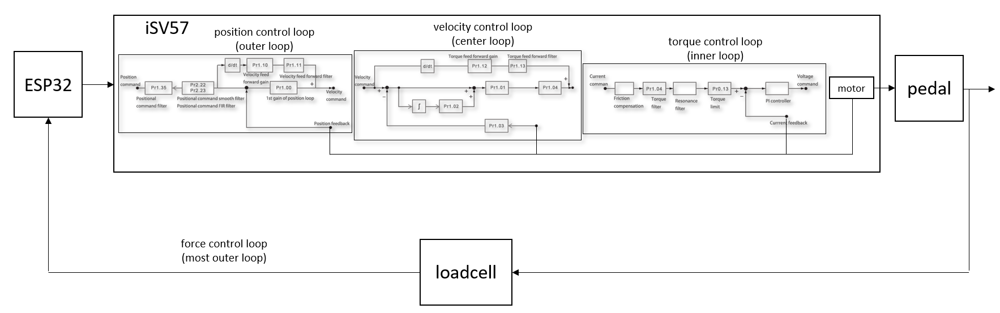

# Stepperonline iSV2-TR Servo manual:
## Purpose:  
Useful to identify which parameters might be used with one ot the other, see chapter 4.1. E.g. position gain (Pr1.00) has no influence in position control mode.

Useful sections:  
Sec. 5.4, gives a good introduction to manual gain adjustment 
Sec. 5.7, feedforward gain 
Sec. 5.10, vibration suppression

## Link:     
https://www.leadshine.com/upfiles/downloads/8aa085a2d9e91e0ec1986b2a35b10ebe_1690180312325.pdf

# Stepperonline iSV2-CAN Servo manual:
## Purpose:
P. 44, gives a description about the gain switching enums.

## Link:
https://www.leadshine.com/upfiles/downloads/4ce2f9e638bcd3a6d002fa895310d0a6_1690180279349.pdf

# Leadshine iSV2 manual:
## Purpose:  
Since the iSV57 manual is poorly written and contains no useful information about the parameterization, vibbration suppression, this document might be used to understand the effect of the different parameters. 

## Link:     
https://www.leadshine.com/productn/iSV2-CAN6020V24G%20Integrated%20Servo%20Motor-0-37-84.html

=================================

# Control loop model
The model of the closed-loop system looks like follows:

The ESP32 (+ADC) and the loadcell are parts of the force control loop. Once the force at the pedal is measured, the ESP calculates the target position to control the pedal force and sends position commands to the iSV57. The iSV57 has three intergrated control loops (position, velocity and torque/current), which control the inner states of the servo.
For good closed-loop performance, each of the control loop parameters must be tuned appropriately. 

# Register settings

## PR0.01 (control mode)
### Recommendation
Pr0.01 = 0 (position control mode)

## PR0.02 (Auto gain adjustment)
### Recommendation
Pr0.02 = 0 (auto gain adjustment off)

<ins>Con</ins>:
- have gotten significantly better performance from manual gain settings.

## PR0.03 (Stiffness asjustment)
## PR0.04 (Inertia rartio)

## PR0.13 (Torque limit)
### Recommendation
Pr0.13 = 500 (set torque to maximum)

## PR0.14 (Excessive position deviation)
### Recommendation
Pr0.14 = max (set position deviation to maximum thus alarm will not be triggered early)

## PR1.00 (1st position loop gain)
### Recommendation
See [tuning manual](StepperTuning.md).

## PR1.01 (1st velocity loop gain)
### Recommendation
See [tuning manual](StepperTuning.md).

## PR1.02 (1st Integral Time Constant of Velocity Loop)
### Recommendation
See [tuning manual](StepperTuning.md).

## PR1.03 (1st velocity detection filter)
### Recommendation
No significant influence observed.

## PR1.04 (1st Torque Filter Time Constant)
### Recommendation
100-300. Significant influence on noise level.

## PR1.05-PR1.09 (2nd gains)
### Recommendation
Since gain switching will be disabled, no influence. 

## PR1.10 (Velocity feed forward gain)
### Recommendation
Increase for faster position control loop, but noise might be increased.

## PR1.11 (Velocity feed forward filter time constant)
### Recommendation
See above.

## PR1.12 (Torque feed forward gain)
### Recommendation
Increase for faster position control loop, but noise might be increased.
Feed forward is always good to relieve the closed-loop. However, the model must be good. 

## PR1.13 (Velocity feed forward filter time constant)
### Recommendation
See above.

## PR1.15 (Torque feed forward filter time constant)

### Recommendation
Pr1.15 = 0 (deactivate gain switching)

<ins>Con</ins>:
- makes the pedal feel strange. 

<ins>Pro</ins>:
- could reduce noise in steady state.

### Description
See [https://github.com/ChrGri/DIY-Sim-Racing-Active-Pedal/edit/main/StepperParameterization/UsefulLinks.md#link-1](https://github.com/ChrGri/DIY-Sim-Racing-Active-Pedal/edit/main/StepperParameterization/UsefulLinks.md#stepperonline-isv2-can-servo-manual)

0: 1st gain fixed 
1: 2nd gain fixed 
3: 1st gain is default. Switch to 2nd gain when torque threshold is exceeded 
4: None 
5: Switch to 2nd gain when velocity threshold is exceeded 
6: Switch to 2nd gain if position error exceeds threshold 
7: Switch to 2nd gain, if position is unequal to zero. 
8: Switch to 2nd gain if position is not yet reached. In steady state 1st gain is active. 
9: Switch to 2nd gain, if velocity exceeds threshold 
10: Like 9, but switch to 2nd gain only if position is unequal to zero. 

## PR2.01 (1st notch frequency)
### Recommendation
Will be applied on the most inner loop (torque).

## PR2.22 (Position command smoothing filter)
### Recommendation
PR2.22 = 0 (deactivate position command smoothing, as it lead to pedal oscillations. Smoothing of the commands are done on the ESP itself.)

## PR2.23 (Position command FIR filter)
### Recommendation
PR2.23 = 0 (deactivate position command smoothing, as it lead to pedal oscillations. Smoothing of the commands are done on the ESP itself.)
