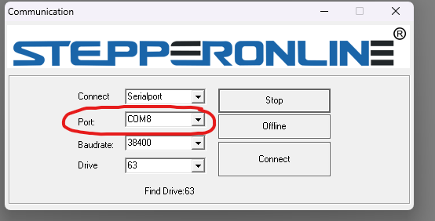
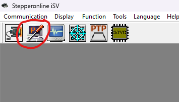
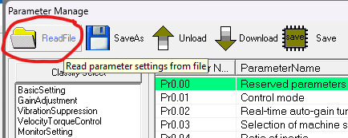
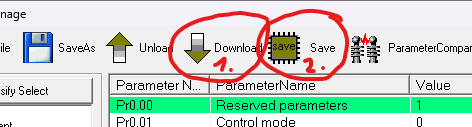

# iSV57T-130 servo config tuning
The iSV57T allows parameter tuning via its RS232 interface. To tune the servo towards this application, parameters have been identiefied for better servo behaviour. To flash this parameterset, follow these steps:

1. Order the RS232 to USB adapter cable mentioned in the BOM, if your PC does not have a native RS232 interface.
2. Download the tuning [software](https://www.omc-stepperonline.com/download/iSV-T_software.zip).
3. Connect the servo to your PC via RS232 interface.
4. Open the tuning software, select the serial port of the motor and connect 

5. Select the configuration window 

6. Read the tuned presets, by opening the corresponding window 

7. Select the [preset](https://github.com/ChrGri/DIY-Sim-Racing-Active-Pedal/blob/main/StepperParameterization/Tuned_130.lsr)
8. Download and save the preset on the servo thus it is automatically used on restart

