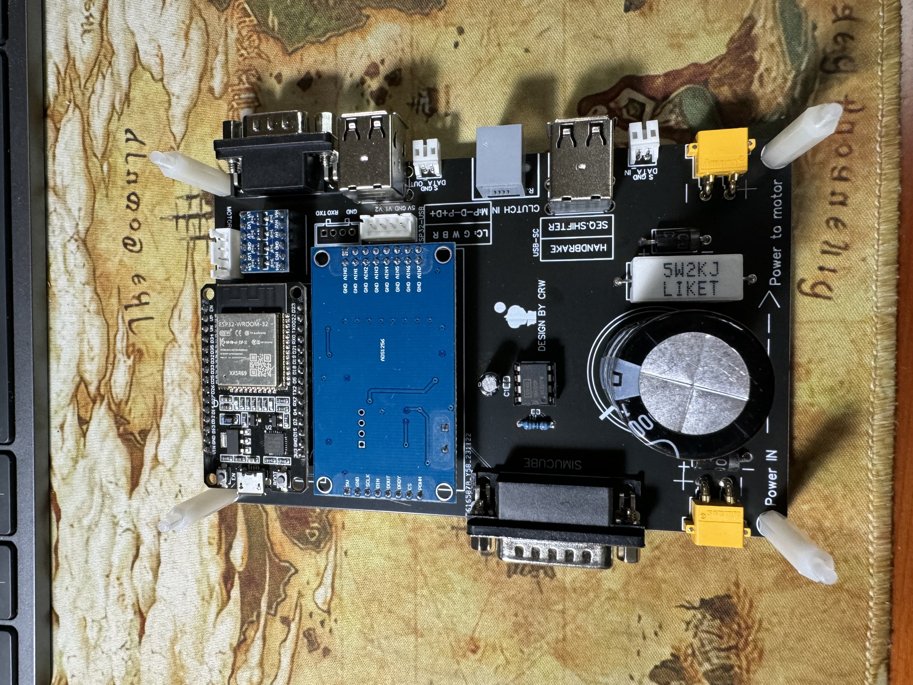
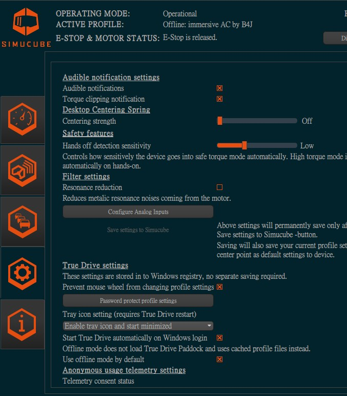

# DIY AP for Simucube D15 port
Changing connection from bluetooth to simucube wheel base D15 port. 
# Arduino code
The arduino code was set BLE connection as default, you need compile the code with uncomment [#define Using_analog_output](https://github.com/tcfshcrw/DIY-AP-For-Simucube-D15-Port/blob/5f9ee92e2915fc8c4bda61bb6a2c49aa94eec56f/Arduino/Esp32/Main/Main.ino#L3C6-L3C6). 
# PCB
 
This is the custom PCB from [https://github.com/ChrGri/DIY-Sim-Racing-FFB-Pedal](https://github.com/ChrGri/DIY-Sim-Racing-FFB-Pedal). 
Including 1 INA122P for loadcell reading for general pedal, 1 data in for GAS input, and 1 data out for analog output to other board. 
It's alos build in power PCB, contian 2 XT30 connector for power in and out. 
The default output was brake pin in truedrive, extra data input was set for gas pin for true drive. 
# Simucube software configuare
There is a analog input config in truedrive. 
 
First set the brake use brake pin(other pins was fine, depend on the design) 
ESP32 output voltage was between 0.1-3.1, so set axis raw value between 3%-60%. 
 
after setup, don't forget to save to wheel base by click save setting to simucube. 

